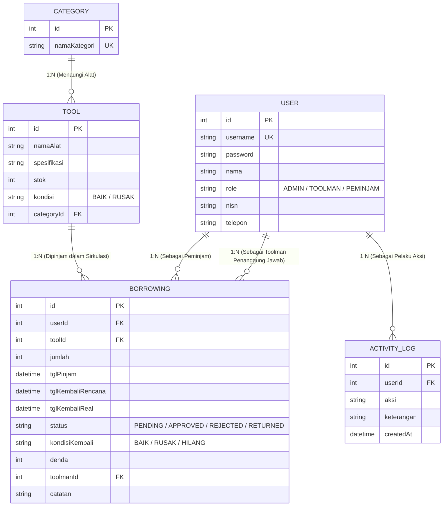

# ⚡ Sistem Peminjaman Sarpras Lab RPL & Elektronika
### Standar Tugas Praktik Uji Kompetensi Keahlian (UKK) & Industri — SMK Telkom

Aplikasi web inventaris dan sirkulasi peminjaman peralatan praktikum laboratorium komputer, rekayasa perangkat lunak, dan teknik elektronika (kabel LAN tester, crimping tool, router Mikrotik, proyektor, solder station, multimeter digital, dsb.) dengan **3 level pengguna (Role-Based Access Control / RBAC)** sesuai standar industri dan instrumen UKK.

---

## 🎯 Latar Belakang Masalah di Sekolah
Peralatan praktikum lab komputer dan bengkel elektronika sering kali tercecer, hilang, atau rusak tanpa ada siswa yang bertanggung jawab. Petugas laboran dan Toolman mengalami kesulitan:
1. Melacak siapa siswa terakhir yang meminjam alat praktikum tertentu.
2. Memverifikasi kondisi fisik alat sebelum dan sesudah kegiatan praktikum berlangsung.
3. Mencatat dan merekapitulasi denda kerusakan atau penggantian sparepart alat secara akuntabel.
4. Menghasilkan laporan sirkulasi sarpras resmi untuk Kepala Laboratorium dan manajemen sekolah.

---

## 👥 3 Level Pengguna (Role-Based Access Control)

| Level / Role | Target Narasumber | Tanggung Jawab & Hak Akses |
|:---|:---|:---|
| **1. ADMIN** | Kepala Laboratorium Komputer / IT Superadmin | CRUD master pengguna, CRUD master sarana alat, CRUD kategori alat, master transaksi sirkulasi, dan memantau audit trail log aktifitas lab. |
| **2. TOOLMAN** | Toolman / Petugas Laboran Bengkel & Lab | Menyetujui/menolak permohonan peminjaman siswa, memantau pengembalian, inspeksi fisik alat (BAIK/RUSAK/HILANG), mencatat denda ganti rugi kerusakan, dan mencetak laporan resmi. |
| **3. PEMINJAM** | Siswa / Guru Praktikan | Melihat ketersediaan stok fisik alat di lab, mengajukan permohonan pinjam alat praktikum, dan mengonfirmasi pengembalian alat ke meja Toolman. |

---

## 📋 Matriks Hak Akses 13 Fitur Lengkap

| No | Fitur Sistem | Admin | Toolman | Peminjam |
|:--:|:---|:---:|:---:|:---:|
| 1 | Login & Logout Multi-Role | ✅ | ✅ | ✅ |
| 2 | CRUD Data Pengguna (User) | ✅ | ❌ (403) | ❌ (403) |
| 3 | CRUD Inventaris Alat Praktikum | ✅ | ❌ (Hanya Lihat) | ❌ (Hanya Lihat) |
| 4 | CRUD Kategori Alat (Jaringan / Hardware / IoT) | ✅ | ❌ (403) | ❌ (403) |
| 5 | Monitoring & CRUD Data Peminjaman | ✅ | ✅ | ❌ (Hanya Milik Sendiri) |
| 6 | Log Aktifitas Sistem Laboratorium | ✅ | ❌ (403) | ❌ (403) |
| 7 | Menyetujui (Approval) & Menolak Peminjaman | ✅ | ✅ | ❌ (403) |
| 8 | Memantau & Memproses Pengembalian Alat | ✅ | ✅ | ❌ (403) |
| 9 | Pemeriksaan Fisik Alat & Input Denda Rusak | ✅ | ✅ | ❌ (403) |
| 10 | Mencetak Laporan Sirkulasi Resmi (Print/PDF) | ✅ | ✅ | ❌ (403) |
| 11 | Melihat Daftar & Ketersediaan Stok Alat | ✅ | ✅ | ✅ |
| 12 | Mengajukan Permohonan Pinjam Alat Praktikum | ✅ | ❌ | ✅ |
| 13 | Mengembalikan Alat ke Meja Toolman (Konfirmasi) | ❌ | ❌ | ✅ |

---

## 🛠️ Tech Stack & Arsitektur Sistem

* **Runtime:** Node.js (v18+ LTS / v20+ / v22+)
* **Framework Web:** Express.js (Arsitektur MVC: *Controllers, Models/Prisma, Routes, Views, Middlewares*)
* **Database Engine:** SQLite (Mandiri dalam 1 berkas `prisma/dev.db` — *Zero-Config*, tanpa perlu XAMPP / MySQL)
* **Object-Relational Mapping (ORM):** Prisma ORM (`@prisma/client` v6+)
* **Autentikasi & Keamanan:** Session-based Authentication (`express-session`), Password Hashing (`bcryptjs`), dan Middleware RBAC Strict.
* **View Engine & Tampilan:** EJS (*Embedded JavaScript*) dengan Tailwind CSS Light Modern Dashboard, FontAwesome 6, dan Google Fonts *Plus Jakarta Sans*.

---

## 🗄️ Skema Database Relasional (`prisma/schema.prisma`)



---

## 🔑 Akun Demo Pengujian (Quick Switch)

Halaman login (`/login`) menyediakan **tombol cepat (1-klik)** untuk mengisi akun demo berikut:

| Akun | Username | Password | Nama & Posisi |
|:---|:---|:---|:---|
| **Admin** | `admin` | `password123` | Ahmad Subarjo, S.Kom (Kepala Laboratorium) |
| **Toolman** | `toolman` | `password123` | Bagus Prakoso, A.Md (Toolman / Laboran) |
| **Peminjam** | `peminjam` | `password123` | Dimas Aditya Pratama (Siswa XII RPL 1) |

---

## 🚀 Panduan Menjalankan Aplikasi

### 1. Prasyarat
Pastikan Node.js (v18 ke atas) telah terpasang di komputer Anda.

### 2. Instalasi Dependensi
```bash
npm install
```

### 3. Migrasi & Sinkronisasi Database
```bash
npx prisma db push
```

### 4. Populasi Data Awal (Seed)
```bash
node prisma/seed.js
```

### 5. Menjalankan Server Aplikasi
```bash
npm run dev
# Atau:
node src/server.js
```
Akses aplikasi melalui browser di: `http://localhost:3000`

### 6. Menjalankan Uji Otomatis (5 Skenario UKK)
```bash
node test_system.js
```

---

## 🧪 Verifikasi 5 Skenario Pengujian Wajib (TEST_CASES.md)

1. **Skenario 1:** Login user sesuai dengan hak akses (Admin, Toolman, Siswa) dan proteksi 403 Forbidden.
2. **Skenario 2:** Admin menambah inventaris alat baru (Contoh: Mikrotik RouterBoard stok 5 unit) dan tercatat di audit log.
3. **Skenario 3:** Siswa mengajukan peminjaman 1 unit Mikrotik untuk praktikum jaringan (status PENDING).
4. **Skenario 4:** Toolman menyetujui peminjaman dan stok alat berkurang secara otomatis menjadi 4 unit.
5. **Skenario 5:** Pengembalian alat dengan simulasi kondisi rusak, hitung denda Rp 50.000, stok kembali 5 unit, dan verifikasi pencatatan di log aktifitas.

*Seluruh 5 skenario telah lulus 26 uji asersi otomatis.* Dokumentasi lengkap dapat dilihat di [TEST_CASES.md](file:///c:/proyek-topik-3/workshop-day-2-smk-telkom/TEST_CASES.md).
